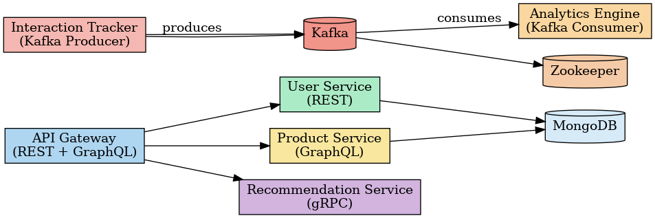

# Moteur de Recommandations Personnalisées - Microservices

Ce projet est une démonstration d'un moteur de recommandations basé sur une architecture **microservices**, conçu avec les technologies suivantes : **REST, GraphQL, gRPC, Kafka**.

---

## Technologies utilisées

| Composant             | Protocole     | Techno principale      |
|-----------------------|---------------|-------------------------|
| User Service          | REST          | Express + MongoDB       |
| Product Service       | GraphQL       | Apollo Server + MongoDB |
| Recommendation Engine | gRPC          | gRPC avec Node.js       |
| Interaction Tracker   | Kafka Producer| KafkaJS                 |
| Analytics Engine      | Kafka Consumer| KafkaJS                 |
| API Gateway           | REST/GraphQL  | Express + gRPC + Axios  |
| Base de données       |               | MongoDB                 |
| Bus de messages       |               | Apache Kafka + Zookeeper|

---

##  Architecture



---

##  Démarrage du projet

### Prérequis
- [Docker](https://www.docker.com/products/docker-desktop/)
- [Docker Compose](https://docs.docker.com/compose/)

### Lancer tous les services :
```bash
docker-compose up --build
```

Les services sont accessibles aux ports suivants :
- `user-service` : [http://localhost:3001/users](http://localhost:3001/users)
- `product-service` : [http://localhost:3002/graphql](http://localhost:3002/graphql)
- `recommendation-service` : gRPC sur port 50051 (appelé via gateway)
- `api-gateway` : [http://localhost:3000](http://localhost:3000)
- `interaction-tracker` : [http://localhost:3003/track](http://localhost:3003/track)

---

##  Exemples d'utilisation

###  Ajouter un utilisateur (REST)
```http
POST http://localhost:3001/users
{
  "name": "Ali",
  "email": "ali@email.com"
}
```

###  Ajouter un produit (GraphQL)
- URL : http://localhost:3002/graphql
```graphql
mutation {
  addProduct(title: "Produit A", description: "Super produit", category: "Livre") {
    id
  }
}
```

###  Obtenir des recommandations (via Gateway → gRPC)
```http
GET http://localhost:3000/recommendations/123
```

###  Tracker un événement utilisateur (Kafka Producer)
```http
POST http://localhost:3003/track
{
  "userId": "123",
  "event": "click_product_A"
}
```

